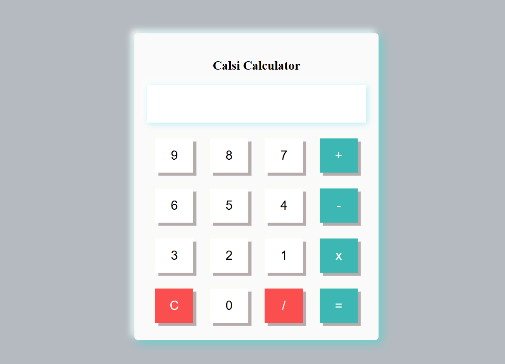

# Calculator

A simple web-based calculator built with HTML, CSS, and JavaScript.

## Features

- Basic arithmetic operations: addition, subtraction, multiplication, and division
- Responsive and clean user interface
- Easy to use

## Usage

1. Clone or download this repository.
2. Open `index.html` in your web browser.

## Project Structure

```
Calculator/
├── index.html
├── style.css
```

## Screenshot



## Author 
 Akhilesh Sharma 
